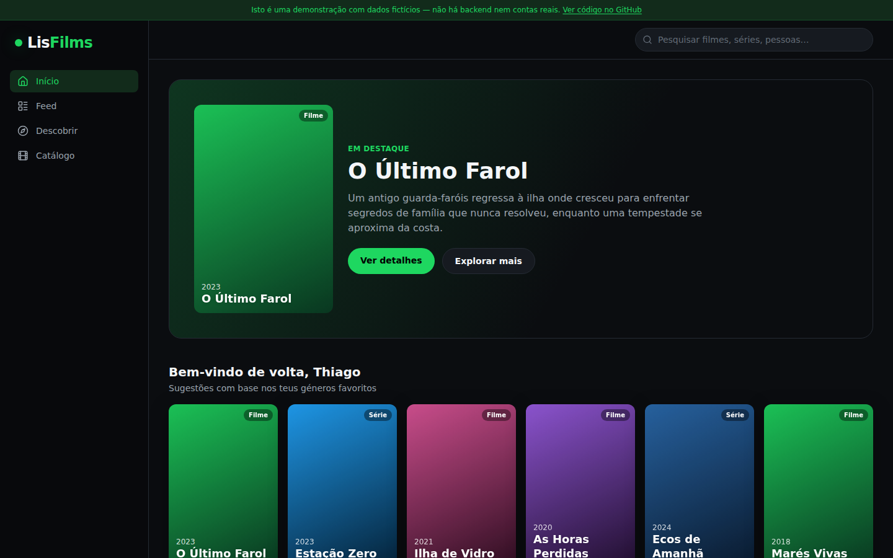
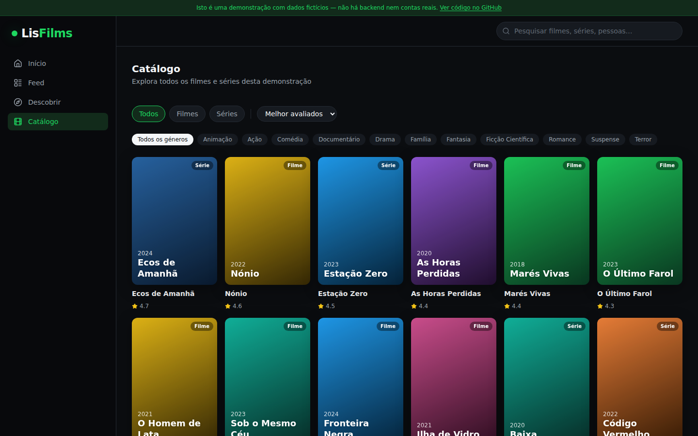
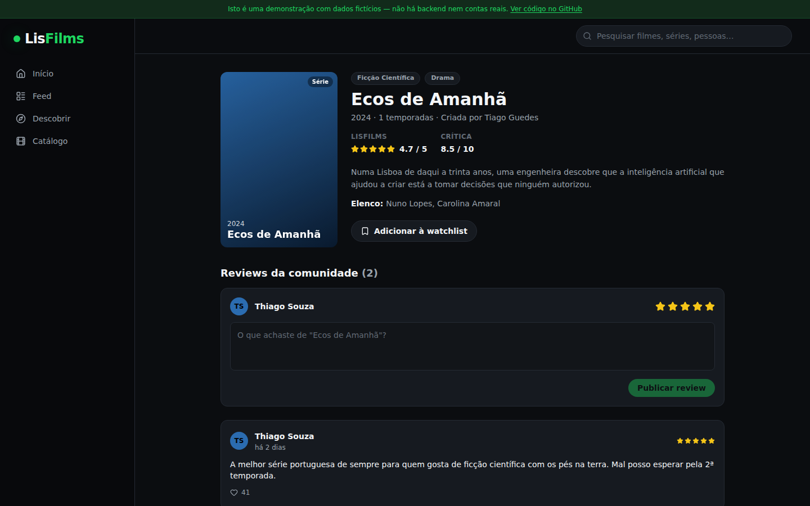
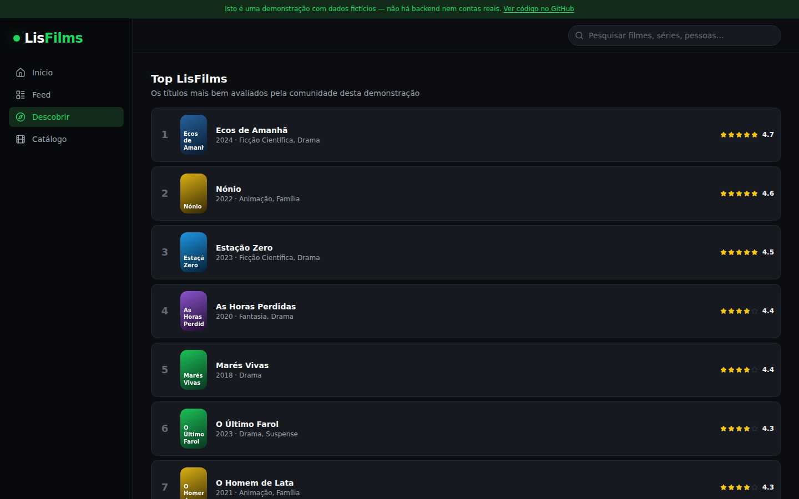
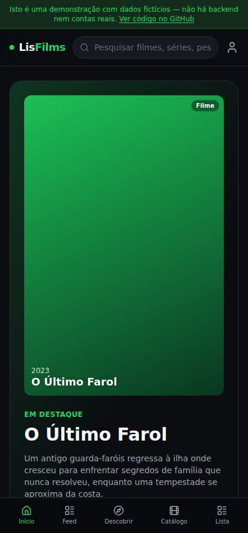

# LisFilms — Demo 🎬

Versão pública de demonstração do **LisFilms**, uma rede social de filmes e séries. Este repositório é standalone: corre inteiramente no browser, com dados fictícios gerados localmente, sem qualquer ligação à aplicação real em produção, a servidores ou a chaves de API.

**[Ver demo ao vivo →](https://thiagodanjos.github.io/lisfilms-demo/)**



## Sobre este repositório

O LisFilms "a sério" é uma aplicação maior — desktop (Python/Tkinter) e web (React), com backend próprio, contas reais e integração com a API da TMDB — desenvolvida como Prova de Aptidão Profissional. Este repositório reconstrói, de raiz e apenas para portefólio, o núcleo da experiência social (catálogo, ficha de filme/série, reviews, feed, perfis e watchlist), com:

- **Dados 100% fictícios** — filmes, séries, pessoas e reviews inventados para esta demo, sem posters nem sinopses reais.
- **Zero backend** — sem API, sem base de dados, sem autenticação real.
- **Zero segredos** — não há chaves nem variáveis de ambiente a configurar.
- **Interatividade local** — dar like numa review, escrever uma review ou guardar um título na watchlist funciona e fica guardado apenas no `localStorage` do teu browser.

## Funcionalidades

- Catálogo de filmes e séries com filtros por tipo e género
- Ficha de título com sinopse, elenco, nota da comunidade (★/5) e nota da crítica (/10)
- Reviews da comunidade, com likes e possibilidade de escrever a tua própria
- Feed de atividade de utilizadores fictícios
- Perfis com estatísticas, géneros favoritos e histórico de reviews
- Watchlist pessoal
- Ranking "Top LisFilms" e secção de lançamentos

## Tecnologias

- [React 19](https://react.dev/) + [TypeScript](https://www.typescriptlang.org/)
- [Vite](https://vite.dev/)
- [Tailwind CSS v4](https://tailwindcss.com/)
- [React Router](https://reactrouter.com/)
- [Zustand](https://zustand-demo.pmnd.rs/) (estado local + persistência em `localStorage`)
- [Lucide Icons](https://lucide.dev/)

## Como correr localmente

```bash
git clone https://github.com/thiagodanjos/lisfilms-demo.git
cd lisfilms-demo
npm install
npm run dev
```

Abre `http://localhost:5173`. Não é preciso nenhuma configuração adicional.

```bash
npm run build     # build de produção em dist/
npm run preview   # pré-visualizar o build
npm run lint      # oxlint
```

## Capturas de ecrã

<table>
  <tr>
    <td></td>
    <td></td>
  </tr>
  <tr>
    <td></td>
    <td></td>
  </tr>
</table>

## Estrutura

```
src/
├── components/     # AppShell (layout) e componentes de UI reutilizáveis
├── data/           # tipos + dados fictícios (filmes, séries, pessoas, reviews)
├── pages/          # uma página por rota
├── store/          # estado local (Zustand) persistido em localStorage
└── lib/            # utilitários
```

## Autor

**Thiago Souza** — [github.com/thiagodanjos](https://github.com/thiagodanjos)

## Licença

Distribuído sob a licença MIT — ver [LICENSE](LICENSE).
